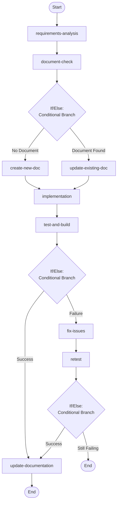

## Workflow Execution Guide

Follow the Mermaid flowchart above to execute the workflow. Each node type has specific execution methods as described below.

### Execution Methods by Node Type

- **Rectangle nodes**: Execute Sub-Agents using the Task tool
- **Diamond nodes (AskUserQuestion:...)**: Use the AskUserQuestion tool to prompt the user and branch based on their response
- **Diamond nodes (Branch/Switch:...)**: Automatically branch based on the results of previous processing (see details section)
- **Rectangle nodes (Prompt nodes)**: Execute the prompts described in the details section below

### If/Else Node Details

#### doc_exists_check(Binary Branch (True/False))

**Evaluation Target**: document search results

**Branch conditions:**
- **Document Found**: Existing documentation found in docs/features/
- **No Document**: No existing documentation found

**Execution method**: Evaluate the results of the previous processing and automatically select the appropriate branch based on the conditions above.

#### validation_check(Binary Branch (True/False))

**Evaluation Target**: test and build results

**Branch conditions:**
- **Success**: All tests pass and build succeeds without errors
- **Failure**: Tests fail or build has errors

**Execution method**: Evaluate the results of the previous processing and automatically select the appropriate branch based on the conditions above.

#### revalidation_check(Binary Branch (True/False))

**Evaluation Target**: retest results

**Branch conditions:**
- **Success**: All tests now pass and build succeeds
- **Still Failing**: Tests still fail or build has errors

**Execution method**: Evaluate the results of the previous processing and automatically select the appropriate branch based on the conditions above.
