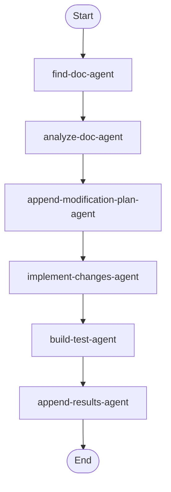

## Workflow Execution Guide

Follow the Mermaid flowchart above to execute the workflow. Each node type has specific execution methods as described below.

### Execution Methods by Node Type

- **Rectangle nodes**: Execute Sub-Agents using the Task tool
- **Diamond nodes (AskUserQuestion:...)**: Use the AskUserQuestion tool to prompt the user and branch based on their response
- **Diamond nodes (Branch/Switch:...)**: Automatically branch based on the results of previous processing (see details section)
- **Rectangle nodes (Prompt nodes)**: Execute the prompts described in the details section below
